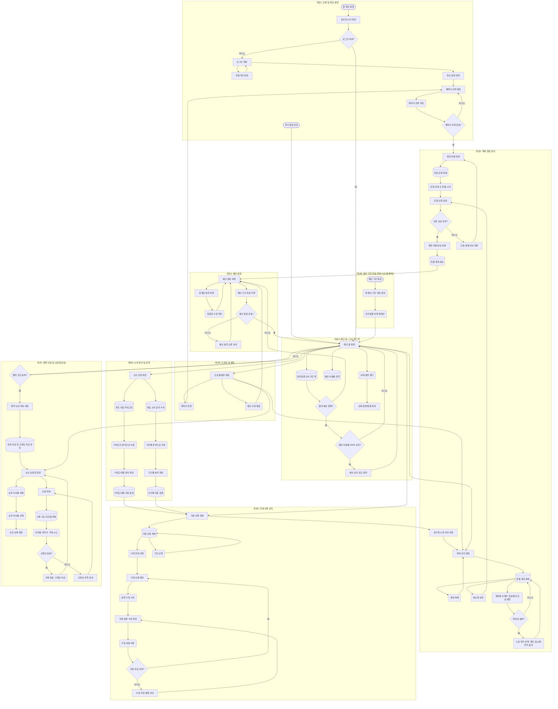

# 유저플로우: 반려동물 감정 기반 소비 관리 가계부 앱

- 원본: Manyfast 유저플로우 "새 플로우 1" (v1, versionId: `eb4a9d20-55bd-4492-bb7a-11bead78bc0d`)
- 2026-08-29 업데이트: `02-requirements-features.md` 통합 반영 결과를 기준으로 노드 12개·엣지 16개 추가
- 노드 78개, 엣지 103개, 섹션 9개

## 노드 타입 범례

| Mermaid 도형 | 타입 | 의미 |
|---|---|---|
| `([Label])` | start | 진입점 |
| `[Label]` | page | 화면 |
| `{Label}` | branch | 분기 조건 |
| `(Label)` | action | 사용자/시스템 동작 |
| `[(Label)]` | data | 데이터 조회/표시 |

## 섹션 목록

| 섹션 ID | 이름 | 관련 요구사항 |
|---|---|---|
| s1 | 인증 및 최초 설정 | R-BPFBTK, R-ENPLNB |
| s2 | 계좌 연동 관리 | R-BPFBTK, R-CCOEWW(F-KBBFRU 노출 설정) |
| s3 | 예산 설정 | R-JNPAKJ |
| s4 | 메인 홈 / 소비 피드백 | R-ENPLNB, R-JNPAKJ |
| s5 | 소비 분석 및 요약 | R-ZHBMMB |
| s6 | 거래 내역 관리 | R-CCOEWW |
| s7 | 절약 보상 및 보관함/상점 | R-VLQYRM |
| s8 | 프로필 및 설정 | (횡단) |
| **s9 (신규)** | **예산 기간 자동 전환** | R-JNPAKJ, R-ENPLNB, R-VLQYRM (시스템 배치) |

## 이번 업데이트로 추가된 노드

| 노드 | 타입 | 섹션 | 근거 |
|---|---|---|---|
| n67 계좌별 가계부 포함/제외 토글 설정 | action | s2 | F-KBBFRU: "계좌 관리 영역에 토글을 표시한다" |
| n68 제외로 설정? | branch | s2 | 토글이 "제외"일 때만 노출 방식 하위 옵션이 열림 |
| n69 노출 방식 선택(뱃지 표시/완전히 숨김) | action | s2 | F-KBBFRU 결정: 제외 계좌의 목록 노출 방식 선택 |
| n70 예산 기간 종료 | start | s9 | R-JNPAKJ 결정: 기간 종료가 배치의 시작점 |
| n71 새 예산 기간 자동 생성 | action | s9 | R-JNPAKJ 결정: 동일 목표로 자동 갱신 |
| n72 반려동물 상태 재계산 | action | s9 | R-VLQYRM 결정: 보상 판정 전에 상태부터 리셋 |
| n73 상점 화면 | page | s7 | F-HPWCNJ: 보관함 → 보관함+상점으로 확장 |
| n74 구매 가능 아이템 목록 | data | s7 | F-HPWCNJ dataSpec: 아이템(상점) 항목 |
| n75 아이템 선택 후 구매 시도 | action | s7 | F-HPWCNJ action: 크레딧으로 아이템 구매 |
| n76 크레딧 충분? | branch | s7 | F-HPWCNJ exceptions: 크레딧 부족 시 구매 차단 |
| n77 구매 완료(크레딧 차감) | action | s7 | F-HPWCNJ outcome: 구매 시 크레딧 즉시 차감 |
| n78 크레딧 부족 안내 | page | s7 | F-HPWCNJ exceptions: 부족 수량 안내 |

## 전체 플로우 (Mermaid)



## 주요 분기 요약

| 분기 노드 | 조건 | 예(Yes) | 아니오(No) |
|---|---|---|---|
| n6: 로그인 여부? | 기존 세션 존재 | 메인 홈(n29)으로 바로 진입 | 로그인 화면(n5)으로 이동 |
| n10: 캐릭터 선택 완료? | 캐릭터 저장됨 | 계좌 연결 화면(n11) | 캐릭터 선택 화면(n8) 유지 |
| n15: 인증 성공 여부? | 코드에프 인증 통과 | 계좌 연결 완료 화면(n16) | 인증 실패 안내(n18) → 재시도 |
| n27: 예산 설정 유효? | 구간 검증 통과 | 메인 홈(n29) | 예산 설정 오류 안내(n28) |
| n32: 활성 예산 존재? | 예산 설정 완료됨 | 사용률 검사(n34) | 예산 설정 화면(n23)으로 유도 |
| n34: 예산 사용률 100% 초과? | 초과 여부 | 예산 초과 경고(n35) | 메인 홈 유지 |
| n53: 저장 성공 여부? | 분류 수정 저장 결과 | 거래 상세 화면(n49) | 저장 실패 안내(n54) |
| n62: 절약 조건 충족? | 새 기간 진입 시 배치 판정 결과 확인 | 절약 보상 획득(n56) | 메인 홈(n29) |
| **n68: 제외로 설정?** (신규) | 계좌를 가계부 집계에서 제외로 토글 | 노출 방식 선택(n69) | 계좌 목록으로 복귀 |
| **n76: 크레딧 충분?** (신규) | 보유 크레딧 ≥ 아이템 가격 | 구매 완료(n77) | 크레딧 부족 안내(n78) |

## 예산 기간 자동 전환 흐름 (신규, s9)

R-JNPAKJ·R-VLQYRM 검토에서 확정한 이벤트 순서를 그대로 다이어그램에 옮겼다.

```
n70 예산 기간 종료 (시스템 트리거, 사용자 조작 없음)
  → n71 새 예산 기간 자동 생성 (동일 목표 금액·동일 상태 구간으로)
  → n72 반려동물 상태 재계산 (새 기간 기준으로 리셋)
  → n29 메인 홈 화면 (사용자가 다음에 앱을 열면 이미 리셋된 상태)
  → n62 절약 조건 충족? (새 기간 진입 시 이 배치 결과를 확인)
```

n1/n2처럼 시작 노드(`([Label])`)로 표기했지만, 사용자가 직접 트리거하는 게 아니라 **예산 기간 종료 시각에 시스템이 자동으로 실행**하는 배치 작업이라는 점이 다르다. Claude Code로 구현할 때 이 세 노드(n70→n71→n72)는 하나의 원자적 배치 잡으로 묶어서, 중간에 실패해도 "새 기간은 생겼는데 상태 재계산은 안 된" 상태가 남지 않게 해야 한다(`04-review-log.md`에 동일 주의사항 기록됨).

## 계좌 노출 설정 흐름 (신규, s2)

```
n20 연결 계좌 목록
  → n67 계좌별 가계부 포함/제외 토글 설정
  → n68 제외로 설정?
      예 → n69 노출 방식 선택(뱃지 표시 / 완전히 숨김) → n20으로 복귀
      아니오(포함 유지) → n20으로 복귀
```

n69에서 "완전히 숨김"을 선택하면 F-RNECMQ·F-TKSQSR·F-IWBASY 세 화면 모두에서 해당 계좌 거래가 조회조차 안 되고, "뱃지 표시"를 선택하면 목록엔 남되 집계에서만 빠진다 — 이 분기가 R-CCOEWW·R-ZHBMMB 두 요구사항의 화면 동작을 동시에 결정한다.

## 상점 흐름 (신규, s7)

```
n58 보상 보관함 화면
  → n73 상점 화면
  → n74 구매 가능 아이템 목록
  → n75 아이템 선택 후 구매 시도
  → n76 크레딧 충분?
      예 → n77 구매 완료(크레딧 차감) → n58로 복귀 (보관함에 새 아이템 반영)
      아니오 → n78 크레딧 부족 안내 → n73로 복귀
```

## 허브 구조

`n29 메인 홈 화면`이 전체 플로우의 중심 허브다. 소비 피드백(s4), 소비 요약(s5), 거래 내역(s6), 절약 보상(s7), 프로필/설정(s8), 계좌 관리(s2)로 모두 직접 연결되고, 이번 업데이트로 **s9(예산 기간 자동 전환)도 n29로 직접 연결**되는 두 번째 진입 경로가 생겼다. `n58 보상 보관함 화면`은 이번 업데이트로 상점(n73)까지 아우르는 s7 내부의 보조 허브 역할을 겸하게 됐다. Claude Code로 라우팅/네비게이션 구조를 짤 때 `HomeScreen`을 중심 허브 컴포넌트로, s9의 세 노드는 화면이 아니라 백그라운드 배치 잡으로 구현하는 근거가 된다.
