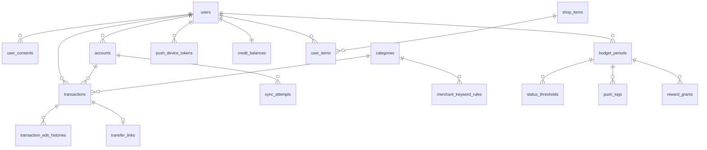

# DB 설계

- 관련 프로젝트: 반려동물 감정 기반 소비 관리 가계부 앱
- 최종 갱신: 2026-09-17
- 대상 DBMS: **PostgreSQL 16 단독** (`05-infra-stack.md`)
- 관련 문서: `02-requirements-features.md`(dataSpec 원본), `08-feature-implementation-map.md`(기능별 사용 테이블), `05-infra-stack.md` 3.3.1절(스키마 관리 방침)

기능 명세의 dataSpec 슬롯을 실제 스키마로 옮긴 것이다. 명세에 없는 필드를 추측해서 넣지 않았고, 추가한 것은 전부 근거를 달았다.

---

## 0. 공통 규약

| 항목 | 결정 | 근거 |
|---|---|---|
| 기본키 | `BIGINT GENERATED ALWAYS AS IDENTITY` | 인덱스가 작고 조인·정렬이 빠르다. 거래 테이블이 사용자당 90일치씩 쌓여 가장 커지는데 거기서 차이가 드러난다 |
| 금액 | `BIGINT`, 원 단위 정수 | 원화는 보조단위가 없다. 부동소수점 오차가 없고 합계·비율 계산이 단순하다. 코드에프 반환값도 원 단위 정수다 |
| 열거형 | `VARCHAR` + `CHECK` 제약 | DB에서 값이 그대로 읽힌다. JPA `@Enumerated(STRING)`과 직결되고, 값 추가는 CHECK만 바꾸는 마이그레이션이면 된다 |
| 시각 | `TIMESTAMPTZ` | 타임존 정보를 잃지 않는다. 애플리케이션 기준 타임존은 KST 고정(아래 참고) |
| 날짜 | `DATE` | 예산 기간 경계처럼 시각이 무의미한 값 |
| 이름 | `snake_case`, 테이블은 복수형 | PostgreSQL 관례 |
| 소프트 삭제 | **쓰지 않는다** | 탈퇴는 즉시 전체 삭제다(Q5). 삭제 플래그를 두면 모든 조회에 조건이 붙고 "삭제했는데 남아 있는" 상태가 생긴다 |
| 감사 컬럼 | 값이 바뀌는 테이블에만 `created_at`·`updated_at` | 이력 테이블처럼 append-only인 곳에는 불필요하다 |

**열거형 값은 대문자 스네이크로 통일한다**(`AUTO_LINKED`, `OVER_BUDGET`).

### 기준 타임존 (2026-09-18, T-052)

모든 시각 계산의 기준은 KST다. 단일 출처는 `com.petgyebu.telo.common.time.AppZone`이며, 코드 어디서도 `ZoneId.of("Asia/Seoul")`을 다시 쓰지 않는다.

**저장은 문제가 없다.** 모든 시각 컬럼이 `TIMESTAMPTZ`이고 엔티티는 `OffsetDateTime`이라 절대 시각이 그대로 보존된다. 문제는 그 시각을 **날짜로 환산**할 때 생긴다. KST는 UTC+9라 한국 시각 00:00~09:00은 UTC로는 아직 전날이다.

```
거래 절대 시각        : 2026-09-30T16:00:00Z
한국 사용자가 본 시각 : 2026-10-01 01:00   (10월 1일 새벽)

UTC 기준 날짜         : 2026-09-30   → 9월 예산에 집계된다
KST 기준 날짜         : 2026-10-01   → 10월이 맞다
```

매달 1일 00:00~09:00에 9시간짜리 구멍이 생긴다. 월간 예산 경계, s9 배치 실행 시각, 가입 코호트 집계가 전부 여기 해당한다.

**지켜야 할 것 2가지**

1. `LocalDate.now()`, `LocalDateTime.now()`처럼 **존 없는 호출을 쓰지 않는다.** `LocalDate.now(AppZone.KST)`로 항상 존을 넘긴다. 이러면 서버 기본 타임존이 무엇이든 결과가 같다.
2. `@Scheduled`에는 `zone = AppZone.KST_ID`를 명시한다. 빠뜨리면 JVM 기본 존으로 동작한다.

**세 층으로 방어한다**

| 층 | 설정 | 역할 |
|---|---|---|
| 코드 | `AppZone.KST` 명시 | 기본 존과 무관하게 항상 옳다. **이것이 먼저다** |
| 운영 컨테이너 | Dockerfile `ENV TZ=Asia/Seoul` | 실수했을 때 피해를 줄이는 보험 |
| 테스트 | `user.timezone=UTC` (build.gradle) | **일부러 운영과 다른 존으로 돌려** 기본 존에 의존하는 코드를 드러낸다 |

세 번째가 핵심이다. 테스트도 KST로 맞춰버리면 존을 빠뜨린 코드가 개발자 노트북에서도 CI에서도 통과해 운영에서만 틀린 답을 낸다.

**확인한 사실**: `eclipse-temurin:25-jre`와 Cloud Run은 기본이 UTC다. `TZ=Asia/Seoul`을 주면 JVM 기본 존이 `Etc/UTC`에서 `Asia/Seoul`로 바뀌고 위 예시의 날짜가 9/30에서 10/1로 교정되는 것을 컨테이너에서 직접 확인했다.

### 사용자 데이터 삭제

사용자를 참조하는 모든 FK에 `ON DELETE CASCADE`를 건다. 탈퇴 시 `DELETE FROM users WHERE id = ?` 한 번으로 전체가 지워지며, 삭제 순서를 코드에서 관리할 필요가 없다. 코드에프 `connectedId` 해지는 삭제 **전에** 수행한다(삭제 후에는 값을 읽을 수 없다).

---

## 1. 테이블 목록

17개다. 기능별로 어떤 테이블을 쓰는지는 `08-feature-implementation-map.md` 참고.

| # | 테이블 | 역할 | 최초 도입 |
|---|---|---|---|
| 1 | `users` | 계정, 선택 캐릭터 | Sprint 0 |
| 2 | `user_consents` | 약관·개인정보·금융 동의 기록 | Sprint 0 |
| 3 | `accounts` | 연결 은행 계좌 | Sprint 1 |
| 4 | `categories` | 고정 카테고리 10개 | Sprint 2 |
| 5 | `merchant_keyword_rules` | 가맹점명 키워드 분류 룰 | Sprint 2 |
| 6 | `transactions` | 수집된 거래 | Sprint 2 |
| 7 | `transfer_links` | 계좌 간 이체 쌍 | Sprint 2 |
| 8 | `sync_attempts` | 동기화 시도 기록 | Sprint 2 |
| 9 | `transaction_edit_histories` | 거래 수정 이력 | Sprint 3 |
| 10 | `budget_periods` | 월간 예산 기간 | Sprint 3 |
| 11 | `status_thresholds` | 예산 상태 구간 6단계 | Sprint 3 |
| 12 | `push_device_tokens` | FCM 디바이스 토큰 | Sprint 4 |
| 13 | `push_logs` | 푸시 발송·열람 기록 | Sprint 4 |
| 14 | `credit_balances` | 사용자별 크레딧 잔액 | Sprint 6 |
| 15 | `reward_grants` | 절약 보상 지급 기록 | Sprint 6 |
| 16 | `shop_items` | 상점 아이템 | Sprint 6 |
| 17 | `user_items` | 보유·배치 아이템 | Sprint 6 |

### 관계 개요



---

## 2. 계정

### 2.1 `users`

| 컬럼 | 타입 | 제약 | 설명 |
|---|---|---|---|
| `id` | BIGINT | PK, identity | |
| `provider` | VARCHAR(10) | NOT NULL, CHECK IN ('KAKAO','APPLE') | 소셜 공급자 |
| `provider_user_id` | VARCHAR(255) | NOT NULL | 공급자가 준 사용자 식별자 |
| `email` | VARCHAR(320) | NULL | **null 허용** |
| `character_type` | VARCHAR(10) | NULL, CHECK IN ('DOG','CAT') | 최초 설정 전에는 null |
| `character_changed_at` | TIMESTAMPTZ | NULL | |
| `joined_at` | TIMESTAMPTZ | NOT NULL, DEFAULT now() | KPI 코호트 기준 t=0 |
| `last_login_at` | TIMESTAMPTZ | NULL | |

**제약·인덱스**

- `UNIQUE (provider, provider_user_id)` — 계정 식별 키
- `email`에 유니크를 걸지 않는다. 애플 로그인은 이메일 가리기를 지원하고 카카오도 동의 항목이라 **null이거나 중복일 수 있다.** 이메일을 계정 식별자로 쓰지 않는다(Q3)
- `joined_at` 인덱스 — 가입 후 24시간·7일 코호트 집계용

**캐릭터를 별도 테이블로 두지 않은 이유**: 사용자당 정확히 하나이고 컬럼이 2개뿐이라 1:1 테이블은 조인만 늘린다. `06-sprint-plan.md`에는 "Character 엔티티"로 적혀 있는데, 이 설계에서는 `users`의 컬럼으로 대신한다. 캐릭터가 여러 개가 되거나 캐릭터별 속성이 생기면 그때 분리한다.

### 2.2 `user_consents`

| 컬럼 | 타입 | 제약 | 설명 |
|---|---|---|---|
| `id` | BIGINT | PK, identity | |
| `user_id` | BIGINT | NOT NULL, FK→users ON DELETE CASCADE | |
| `consent_type` | VARCHAR(30) | NOT NULL, CHECK | 아래 4종 |
| `consent_version` | VARCHAR(20) | NOT NULL | 약관 개정 시 재동의 판단 |
| `consented_at` | TIMESTAMPTZ | NOT NULL | |

`consent_type` 값: `TERMS_OF_SERVICE`, `PRIVACY_POLICY`(가입 시) / `CODEF_THIRD_PARTY`, `FINANCIAL_DATA_INQUIRY`(계좌 연결 직전).

**인덱스**: `(user_id, consent_type, consented_at DESC)` — 최신 동의 버전 조회

동의를 갱신할 때 기존 행을 수정하지 않고 새 행을 추가한다. 언제 어느 버전에 동의했는지가 기록으로 남아야 한다.

### 리프레시 토큰

**테이블을 만들지 않는다.** 폐기 상태는 Upstash Redis에 TTL 14일로 저장한다(`05-infra-stack.md`). 만료된 항목이 자동으로 사라져 정리 배치가 필요 없다. 로컬 개발에서 Redis 없이 돌려야 하면 인메모리 구현으로 대체하고, DB 테이블은 두지 않는다.

---

## 3. 계좌와 거래

### 3.1 `accounts`

| 컬럼 | 타입 | 제약 | 설명 |
|---|---|---|---|
| `id` | BIGINT | PK, identity | |
| `user_id` | BIGINT | NOT NULL, FK→users ON DELETE CASCADE | |
| `bank_code` | VARCHAR(10) | NOT NULL | **VARCHAR다.** 은행 조직코드는 앞자리가 0일 수 있어 정수로 저장하면 0이 날아간다 |
| `codef_connected_id` | VARCHAR(255) | NOT NULL | 탈퇴·계좌 해제 시 해지에 필요 |
| `masked_account_no` | VARCHAR(50) | NOT NULL | 마스킹된 계좌번호. 원본은 저장하지 않는다 |
| `account_name` | VARCHAR(100) | NULL | 코드에프가 주면 저장 |
| `consent_status` | VARCHAR(20) | NOT NULL, CHECK IN ('ACTIVE','EXPIRED','REVOKED') | 거래 조회 동의 상태 |
| `consent_expires_at` | TIMESTAMPTZ | NULL | |
| `last_synced_at` | TIMESTAMPTZ | NULL | 마지막 성공 동기화 |
| `reauth_required` | BOOLEAN | NOT NULL, DEFAULT FALSE | 2-way 추가인증 은행의 무인 동기화 실패 대응 |
| `included_in_budget` | BOOLEAN | NOT NULL, DEFAULT TRUE | 가계부 집계 포함 여부 |
| `display_mode` | VARCHAR(10) | NOT NULL, DEFAULT 'BADGE', CHECK IN ('BADGE','HIDDEN') | 제외 계좌의 목록 노출 방식 |
| `created_at` | TIMESTAMPTZ | NOT NULL, DEFAULT now() | |
| `updated_at` | TIMESTAMPTZ | NOT NULL, DEFAULT now() | |

**제약·인덱스**

- `UNIQUE (user_id, bank_code, masked_account_no)` — 같은 계좌를 두 번 연결하는 것을 막는다. 동일 은행 복수 계좌는 마스킹 번호가 달라 허용된다
- `INDEX (user_id)` — 계좌 목록 조회
- `INDEX (consent_status, last_synced_at)` — 스케줄러가 동기화 대상 계좌를 고를 때

`display_mode`는 `included_in_budget = FALSE`일 때만 의미가 있다. 포함 상태에서는 무시한다. 별도 테이블로 분리하지 않는다.

### 3.2 `categories`

고정 10개 시드 데이터다. 사용자가 추가·삭제할 수 없다(Q7).

| 컬럼 | 타입 | 제약 |
|---|---|---|
| `id` | SMALLINT | PK, **명시적 값** |
| `code` | VARCHAR(30) | NOT NULL, UNIQUE |
| `name` | VARCHAR(30) | NOT NULL |
| `sort_order` | SMALLINT | NOT NULL |

| id | code | name |
|---|---|---|
| 1 | `FOOD` | 식비 |
| 2 | `CAFE_SNACK` | 카페·간식 |
| 3 | `TRANSPORT` | 교통 |
| 4 | `SHOPPING` | 쇼핑 |
| 5 | `MEDICAL` | 의료·건강 |
| 6 | `CULTURE` | 문화·여가 |
| 7 | `HOUSING_COMM` | 주거·통신 |
| 8 | `FINANCE_INSURANCE` | 금융·보험 |
| 9 | `SOCIAL_EVENT` | 경조사비 |
| 99 | `UNCLASSIFIED` | 미분류 |

**identity를 쓰지 않고 id를 직접 박는 유일한 테이블이다.** 값이 고정이고 시드로 관리하므로 ID가 환경마다 달라지면 안 된다. 미분류를 99로 둔 것은 나중에 카테고리를 추가할 여지를 남기기 위함이다.

### 3.3 `merchant_keyword_rules`

| 컬럼 | 타입 | 제약 | 설명 |
|---|---|---|---|
| `id` | BIGINT | PK, identity | |
| `category_id` | SMALLINT | NOT NULL, FK→categories | 매칭 시 지정할 카테고리 |
| `keywords` | JSONB | NOT NULL | 가맹점명 키워드 배열 |
| `priority` | SMALLINT | NOT NULL, DEFAULT 0 | 여러 룰이 걸릴 때 높은 값 우선 |

**인덱스**: `keywords`에 **GIN 인덱스**(`06-sprint-plan.md` Sprint 2)

시드 데이터로 관리하며 관리자 화면을 만들지 않는다(Q12). 룰 변경에는 배포가 필요하다.

### 3.4 `transactions`

가장 큰 테이블이다. 사용자당 최초 90일치가 한 번에 들어오고 이후 계속 쌓인다.

| 컬럼 | 타입 | 제약 | 설명 |
|---|---|---|---|
| `id` | BIGINT | PK, identity | |
| `user_id` | BIGINT | NOT NULL, FK→users ON DELETE CASCADE | **비정규화.** 아래 설명 참고 |
| `account_id` | BIGINT | NOT NULL, FK→accounts ON DELETE CASCADE | |
| `codef_transaction_id` | VARCHAR(255) | NOT NULL | 대행사 거래 식별자 |
| `transacted_at` | TIMESTAMPTZ | NOT NULL | 거래 일시 |
| `amount` | BIGINT | NOT NULL, CHECK (amount > 0) | **항상 양수.** 방향은 `txn_type`이 정한다 |
| `merchant` | VARCHAR(255) | NULL | 거래처 |
| `txn_type` | VARCHAR(10) | NOT NULL, CHECK IN ('INCOME','EXPENSE') | 수입·지출 구분 |
| `category_id` | SMALLINT | NOT NULL, FK→categories, DEFAULT 99 | 미매칭은 99(미분류) |
| `initial_classification_source` | VARCHAR(20) | NOT NULL, CHECK IN ('AUTO_MATCHED','UNCLASSIFIED') | **최초 값 고정.** 사용자 수정 시에도 갱신 금지 |
| `transfer_status` | VARCHAR(20) | NOT NULL, DEFAULT 'NONE', CHECK | 아래 5종 |
| `refund_status` | VARCHAR(20) | NOT NULL, DEFAULT 'NONE', CHECK IN ('NONE','ORIGINAL','REFUND') | 취소·환불 상태 |
| `linked_refund_transaction_id` | BIGINT | NULL, FK→transactions | 원거래↔환불 연결 |
| `memo` | VARCHAR(255) | NULL | 사용자 메모 |
| `created_at` | TIMESTAMPTZ | NOT NULL, DEFAULT now() | |
| `updated_at` | TIMESTAMPTZ | NOT NULL, DEFAULT now() | |

`transfer_status` 값: `NONE`(이체 아님), `PENDING_CONFIRM`(후보, 사용자 확인 대기), `AUTO_LINKED`(자동 연결), `USER_CONFIRMED`(사용자가 이체로 확인), `UNLINKED`(자동 연결을 사용자가 해제).

**`user_id`를 비정규화한 이유**: 예산 사용률, 소비 요약, 카테고리별·기간별 분석이 전부 "사용자 + 기간" 기준 집계다. `accounts`를 거쳐 조인하면 모든 집계 쿼리에 조인이 하나씩 붙는다. 사용자당 거래가 수천 건 이상 쌓이는 구조라 여기서 손해가 크다. 대신 `account_id`와 `user_id`가 어긋날 수 있으므로 **거래 저장은 반드시 계좌 조회를 거친 경로로만** 수행한다.

**제약·인덱스**

| 인덱스 | 용도 |
|---|---|
| `UNIQUE (account_id, codef_transaction_id)` | 중복 수집 방지. 애플리케이션 판정(식별정보+일시+금액+거래처)에 더한 이중 방어 |
| `(user_id, transacted_at DESC)` | 거래 목록 조회, 기간별 집계 |
| `(user_id, transacted_at, category_id)` | 카테고리별 집계 |
| `(account_id, transacted_at)` | 계좌 단위 조회, 동기화 시 최근 거래 확인 |
| `(account_id, amount, transacted_at)` | **이체 후보 탐색.** 금액 완전 일치 + 10분 이내 조건을 이 인덱스로 좁힌다 |
| `(transfer_status)` WHERE `transfer_status = 'PENDING_CONFIRM'` | 부분 인덱스. 확인 대기 후보만 모아 보는 화면용 |

**환불 순액 처리**: 원거래와 환불을 각각 행으로 저장하고 `linked_refund_transaction_id`로 잇는다. 목록에는 순액만 보이지만 **저장은 두 행 그대로** 한다. 상세 화면에서 원거래 금액과 환불 금액을 각각 보여줘야 하기 때문이다. 순액은 집계 시점에 계산한다.

### 3.5 `transfer_links`

| 컬럼 | 타입 | 제약 | 설명 |
|---|---|---|---|
| `id` | BIGINT | PK, identity | |
| `withdrawal_transaction_id` | BIGINT | NOT NULL, UNIQUE, FK→transactions ON DELETE CASCADE | 출금 거래 |
| `deposit_transaction_id` | BIGINT | NOT NULL, UNIQUE, FK→transactions ON DELETE CASCADE | 입금 거래 |
| `link_status` | VARCHAR(20) | NOT NULL, CHECK IN ('AUTO','USER_CONFIRMED') | 연결 근거 |
| `match_reason` | VARCHAR(255) | NULL | 판단 근거(금액·시각 차이 등) |
| `confirmed_at` | TIMESTAMPTZ | NULL | 사용자 확인 시각 |
| `created_at` | TIMESTAMPTZ | NOT NULL, DEFAULT now() | |

**양쪽 거래 식별자에 각각 UNIQUE를 건다.** 하나의 출금이 여러 입금과 엮이는 상황을 DB가 막는다. 명세상 그런 경우는 자동 연결하지 않고 사용자 확인 대상으로 남겨야 한다.

연결을 해제하면 행을 **삭제**하고 양쪽 거래의 `transfer_status`를 `UNLINKED`로 바꾼다. 해제 이력은 `transaction_edit_histories`에 남는다.

### 3.6 `sync_attempts`

| 컬럼 | 타입 | 제약 | 설명 |
|---|---|---|---|
| `id` | BIGINT | PK, identity | |
| `user_id` | BIGINT | NOT NULL, FK→users ON DELETE CASCADE | |
| `account_id` | BIGINT | NULL, FK→accounts ON DELETE SET NULL | 계좌 해제 후에도 기록은 남긴다 |
| `bank_code` | VARCHAR(10) | NOT NULL | 계좌가 지워져도 은행은 알 수 있게 |
| `trigger_type` | VARCHAR(20) | NOT NULL, CHECK IN ('SCHEDULED','MANUAL') | **KPI 모수 계산용.** 성공률은 "예정된 동기화" 기준이라 수동 요청과 구분해야 한다 |
| `attempted_at` | TIMESTAMPTZ | NOT NULL | |
| `result` | VARCHAR(10) | NOT NULL, CHECK IN ('SUCCESS','FAILURE') | |
| `failure_reason` | VARCHAR(500) | NULL | |
| `retry_count` | SMALLINT | NOT NULL, DEFAULT 0 | |

**인덱스**: `(account_id, attempted_at DESC)`, `(trigger_type, attempted_at)` — 후자는 수집 성공률 95% 지표 집계용

append-only라 `updated_at`이 없다.

### 3.7 `transaction_edit_histories`

| 컬럼 | 타입 | 제약 |
|---|---|---|
| `id` | BIGINT | PK, identity |
| `transaction_id` | BIGINT | NOT NULL, FK→transactions ON DELETE CASCADE |
| `user_id` | BIGINT | NOT NULL, FK→users ON DELETE CASCADE |
| `edit_type` | VARCHAR(20) | NOT NULL, CHECK IN ('CATEGORY','TXN_TYPE','MEMO','TRANSFER') |
| `before_value` | VARCHAR(255) | NULL |
| `after_value` | VARCHAR(255) | NULL |
| `edited_at` | TIMESTAMPTZ | NOT NULL, DEFAULT now() |

**인덱스**: `(transaction_id, edited_at DESC)`

수정 종류마다 컬럼을 따로 두는 대신 `edit_type` + 값 한 쌍으로 일반화했다. 한 번의 수정으로 여러 항목이 바뀌면 행이 여러 개 생긴다. 이력 조회가 화면 기능이 아니라 추적용이라 이 정도면 충분하다.

---

## 4. 예산과 피드백

### 4.1 `budget_periods`

| 컬럼 | 타입 | 제약 | 설명 |
|---|---|---|---|
| `id` | BIGINT | PK, identity | |
| `user_id` | BIGINT | NOT NULL, FK→users ON DELETE CASCADE | |
| `period_start` | DATE | NOT NULL | 매월 1일 (KST) |
| `period_end` | DATE | NOT NULL | 해당 월 말일 (KST) |
| `target_amount` | BIGINT | NOT NULL, CHECK (target_amount > 0) | 현재 목표 금액. 사용자가 수정하면 바뀐다 |
| `target_amount_snapshot` | BIGINT | NOT NULL | **기간 시작 시점 목표.** 절약 보상 판정 기준이며 이후 바뀌지 않는다 |
| `status` | VARCHAR(10) | NOT NULL, CHECK IN ('ACTIVE','CLOSED') | |
| `created_at` | TIMESTAMPTZ | NOT NULL, DEFAULT now() | |
| `updated_at` | TIMESTAMPTZ | NOT NULL, DEFAULT now() | |

**제약·인덱스**

- `UNIQUE (user_id, period_start)` — 같은 달에 예산 기간이 둘 생기는 것을 막는다. s9 배치가 중복 실행돼도 안전하다
- `INDEX (user_id, status)` — 활성 예산 조회
- `INDEX (status, period_end)` — s9 배치가 종료된 기간을 찾을 때

**목표 금액이 두 개인 이유**: 사용률·캐릭터 상태는 `target_amount`(현재 값)로 계산하고, 절약 보상은 `target_amount_snapshot`(기간 시작 값)으로 판정한다. 기간 중 목표를 올려 보상을 쉽게 타는 것을 막으면서, 화면은 사용자가 방금 바꾼 값을 즉시 반영한다(R-JNPAKJ 결정 3, R-VLQYRM 이월 항목).

### 4.2 `status_thresholds`

| 컬럼 | 타입 | 제약 | 설명 |
|---|---|---|---|
| `id` | BIGINT | PK, identity | |
| `budget_period_id` | BIGINT | NOT NULL, FK→budget_periods ON DELETE CASCADE | |
| `status_code` | VARCHAR(20) | NOT NULL, CHECK | 아래 6종 |
| `start_rate` | NUMERIC(5,2) | NOT NULL, CHECK (start_rate >= 0) | 구간 시작 사용률(%) |
| `end_rate` | NUMERIC(5,2) | NULL | 구간 끝. **`OVER_BUDGET`만 NULL**(상한 없음) |
| `sort_order` | SMALLINT | NOT NULL | 1~6 |
| `updated_at` | TIMESTAMPTZ | NOT NULL, DEFAULT now() | |

`status_code` 값과 기본값:

| sort | status_code | 상태 | 기본 구간 |
|---|---|---|---|
| 1 | `REST` | 휴식 | 0 ~ 40 |
| 2 | `WAKE` | 기상 | 40 ~ 60 |
| 3 | `INTEREST` | 관심 | 60 ~ 75 |
| 4 | `ANXIOUS` | 불안 | 75 ~ 90 |
| 5 | `STRONG_WARNING` | 강한 경고 | 90 ~ 100 |
| 6 | `OVER_BUDGET` | 예산 초과 | 100 ~ |

**제약**: `UNIQUE (budget_period_id, status_code)` — 한 기간에 같은 상태가 둘일 수 없다

**경계값 판정은 DB가 아니라 애플리케이션에서 한다.** 오른쪽 닫힘 `(시작, 끝]`이고 0%만 예외적으로 첫 구간에 포함되는 규칙은 SQL 제약으로 표현하기 번거롭다. 구간 검증(0% 고정, 오름차순, 중복·공백 없음, 6단계 전부 존재)도 저장 전에 애플리케이션이 수행한다.

상태 묘사 문구는 **테이블로 만들지 않는다.** 6개 고정 문자열이고 캐릭터 유형과 무관하며 사용자가 바꿀 수 없다. 상수로 두고, 다국어나 A/B 테스트가 필요해지면 그때 테이블로 옮긴다.

### 4.3 `push_device_tokens`

| 컬럼 | 타입 | 제약 |
|---|---|---|
| `id` | BIGINT | PK, identity |
| `user_id` | BIGINT | NOT NULL, FK→users ON DELETE CASCADE |
| `fcm_token` | VARCHAR(512) | NOT NULL, UNIQUE |
| `platform` | VARCHAR(10) | NOT NULL, CHECK IN ('ANDROID','IOS') |
| `created_at` | TIMESTAMPTZ | NOT NULL, DEFAULT now() |
| `updated_at` | TIMESTAMPTZ | NOT NULL, DEFAULT now() |

**인덱스**: `(user_id)`

`fcm_token`에 UNIQUE를 걸면 기기를 넘겨받은 경우(같은 토큰이 다른 사용자에게) 충돌로 감지된다. 토큰 등록 시 upsert로 소유자를 갱신한다. 웹 푸시는 없으므로 `platform`에 `WEB`이 없다(Q9).

### 4.4 `push_logs`

| 컬럼 | 타입 | 제약 | 설명 |
|---|---|---|---|
| `id` | BIGINT | PK, identity | |
| `user_id` | BIGINT | NOT NULL, FK→users ON DELETE CASCADE | |
| `budget_period_id` | BIGINT | NOT NULL, FK→budget_periods ON DELETE CASCADE | |
| `threshold_type` | VARCHAR(20) | NOT NULL, CHECK IN ('STRONG_WARNING','OVER_BUDGET') | |
| `sent_at` | TIMESTAMPTZ | NOT NULL | |
| `read_at` | TIMESTAMPTZ | NULL | 앱에서 알림을 탭하면 기록 |

**제약**: `UNIQUE (budget_period_id, threshold_type)`

**이 유니크 제약이 "기간당 1회, 재발송 없음" 규칙을 DB에서 보장한다**(Q13). Upstash 키(`budget_period_id:threshold`)가 유실되거나 배치가 중복 실행돼도 두 번째 발송은 제약 위반으로 막힌다. Redis는 빠른 판정용이고 DB가 최종 방어선이다.

`read_at`이 KPI "예산 초과 경고 확인율"의 분자다(Q11).

---

## 5. 보상과 상점

### 5.1 `credit_balances`

| 컬럼 | 타입 | 제약 |
|---|---|---|
| `user_id` | BIGINT | **PK**, FK→users ON DELETE CASCADE |
| `balance` | BIGINT | NOT NULL, DEFAULT 0, CHECK (balance >= 0) |
| `updated_at` | TIMESTAMPTZ | NOT NULL, DEFAULT now() |

사용자당 한 행이라 `user_id`가 곧 PK다. 별도 `id`를 두지 않는다.

`CHECK (balance >= 0)`가 잔액 부족 구매를 DB에서 막는다. 애플리케이션 검사와 `SELECT FOR UPDATE`에 더한 마지막 방어선이다.

**갱신 시 반드시 `SELECT ... FOR UPDATE`로 행을 잠근다**(`06-sprint-plan.md` Sprint 6). 배치의 보상 지급과 사용자의 구매가 동시에 들어올 수 있다.

### 5.2 `reward_grants`

| 컬럼 | 타입 | 제약 | 설명 |
|---|---|---|---|
| `id` | BIGINT | PK, identity | |
| `user_id` | BIGINT | NOT NULL, FK→users ON DELETE CASCADE | |
| `budget_period_id` | BIGINT | NOT NULL, FK→budget_periods ON DELETE CASCADE | 판정 대상 기간 |
| `condition_type` | VARCHAR(30) | NOT NULL, CHECK IN ('WITHIN_TARGET','SAVED_10_PERCENT') | 지급 조건 |
| `credit_amount` | BIGINT | NOT NULL | 100 또는 200 |
| `period_expense_total` | BIGINT | NOT NULL | 판정 근거: 해당 기간 지출 합계 |
| `previous_period_expense_total` | BIGINT | NULL | 판정 근거: 직전 기간 지출. 첫 기간은 NULL |
| `granted_at` | TIMESTAMPTZ | NOT NULL, DEFAULT now() | |

**제약**: `UNIQUE (user_id, budget_period_id, condition_type)`

**이 유니크 제약이 "동일 조건 중복 지급 금지"를 보장한다.** 배치가 재실행돼도 두 번 지급되지 않는다.

두 조건을 모두 충족하면 **행이 2개 생기고** 크레딧은 합산되어 300이 된다. 조건별로 지급 사유를 보여줘야 해서(F-EZZFNU display) 한 행에 합쳐 넣지 않는다.

판정 근거 두 컬럼은 명세의 dataSpec에 있는 항목이다. 나중에 "왜 보상을 못 받았는지" 확인할 때도 쓰인다.

### 방 꾸미기 슬롯 (Q16)

아이템은 캐릭터에 입히지 않고 반려동물의 방을 꾸민다. 슬롯은 4개이며 각 1개씩 배치한다.

| 순서 | 슬롯 | `item_type` | 설명 |
|---|---|---|---|
| 1 | 벽지 | `WALLPAPER` | 방 배경 |
| 2 | 바닥 | `FLOOR` | 카펫·장판 |
| 3 | 집 | `HOUSE` | 반려동물 집·쿠션 |
| 4 | 장난감 | `TOY` | 소품 |

렌더링 순서는 **벽지 → 바닥 → 집 → 캐릭터 → 장난감**으로 고정한다. 캐릭터는 집 앞에 앉고 장난감이 가장 앞에 온다. 슬롯 순서가 곧 z-order라 별도 순서 컬럼이 필요 없다.

캐릭터 착용 방식을 쓰지 않은 이유는 아이템 하나가 캐릭터 2종 × 상태 6단계 = 12개 애니메이션 각각에서 위치가 맞아야 해, 아이템을 늘리는 비용이 급격히 커지기 때문이다. 방 아이템은 캐릭터 포즈와 무관하다.

### 5.3 `shop_items`

| 컬럼 | 타입 | 제약 | 설명 |
|---|---|---|---|
| `id` | BIGINT | PK, identity | |
| `code` | VARCHAR(50) | NOT NULL, UNIQUE | 시드 데이터 식별용 |
| `name` | VARCHAR(100) | NOT NULL | |
| `item_type` | VARCHAR(20) | NOT NULL, CHECK IN ('WALLPAPER','FLOOR','HOUSE','TOY') | 방 꾸미기 슬롯. 벽지·바닥·집·장난감 |
| `image_url` | VARCHAR(500) | NOT NULL | Cloud Storage 경로 |
| `price_credits` | BIGINT | NOT NULL, CHECK (price_credits BETWEEN 100 AND 500) | 명세가 정한 가격대 |
| `description` | VARCHAR(255) | NULL | |
| `sort_order` | SMALLINT | NOT NULL, DEFAULT 0 | |
| `is_active` | BOOLEAN | NOT NULL, DEFAULT TRUE | 판매 중단 시 false. 이미 산 사람의 보유는 유지된다 |

시드 데이터로 관리한다(Q12).

### 5.4 `user_items`

| 컬럼 | 타입 | 제약 | 설명 |
|---|---|---|---|
| `id` | BIGINT | PK, identity | |
| `user_id` | BIGINT | NOT NULL, FK→users ON DELETE CASCADE | |
| `shop_item_id` | BIGINT | NOT NULL, FK→shop_items | |
| `item_type` | VARCHAR(20) | NOT NULL, CHECK IN ('WALLPAPER','FLOOR','HOUSE','TOY') | **`shop_items`에서 복사한 비정규화 컬럼.** 아래 설명 참고 |
| `acquisition_type` | VARCHAR(10) | NOT NULL, CHECK IN ('PURCHASE','GRANT') | 명세가 획득 경로를 구매·지급으로 구분한다 |
| `price_paid` | BIGINT | NULL | **구매 시점 가격 스냅샷.** 가격이 바뀌어도 보관함에 당시 가격이 남는다 |
| `acquired_at` | TIMESTAMPTZ | NOT NULL, DEFAULT now() | |
| `is_placed` | BOOLEAN | NOT NULL, DEFAULT FALSE | 방 배치 여부(Q8·Q16) |

**제약**: `UNIQUE (user_id, shop_item_id)` — 같은 아이템 중복 구매 방지

**인덱스**

- `UNIQUE (user_id, item_type)` WHERE `is_placed = TRUE` — **부분 유니크 인덱스.** 슬롯당 1개 규칙을 DB가 보장한다
- 메인 홈은 이 인덱스로 배치된 4개를 한 번에 읽는다

#### `item_type`을 비정규화한 이유

슬롯당 1개를 DB 제약으로 막으려면 `user_items` 자체에 `item_type`이 있어야 한다. **PostgreSQL의 부분 유니크 인덱스는 해당 테이블의 컬럼만 참조할 수 있어서, `shop_items`를 조인해 만들 수 없다.** 조인으로 풀려면 트리거나 머티리얼라이즈드 뷰가 필요한데 둘 다 이 규모에 과하다.

**구현 규칙**: 구매·지급으로 `user_items` 행을 만들 때 `shop_items.item_type`을 복사해 넣는다. 이후 이 값을 변경하지 않는다(상점 아이템의 슬롯이 바뀌는 일은 없다). 엔티티 매핑에서 `updatable = false`로 막는다.

이 컬럼을 빠뜨리면 슬롯당 1개 규칙이 애플리케이션 검사에만 의존하게 되고, 동시 요청에서 같은 슬롯에 두 개가 배치되는 상태가 만들어진다.

---

## 5.5 마이그레이션 검증 테스트

`PostgresMigrationTest`(Testcontainers + PostgreSQL 16)가 운영 프로필을 실제로 기동해 Flyway 실행과 `ddl-auto: validate` 통과를 검증한다. 엔티티를 추가하고 마이그레이션을 빠뜨리면 이 테스트가 실패한다.

**두 테스트를 모두 유지해야 한다.** `TeloApplicationTests`는 `local` 프로필(H2·Flyway 비활성)이라 같은 누락을 잡지 못한다. 2026-09-17에 마이그레이션 없는 엔티티를 넣고 확인한 결과, local 테스트는 통과하고 Testcontainers 테스트만 `Schema validation: missing table`로 실패했다.

**Docker가 필요하다.** Docker 없이 `./gradlew build`를 돌리면 이 테스트가 실패한다. 조건부 스킵을 넣지 않은 것은 의도적이다. 스킵되면 CI가 초록불인 채로 검증이 사라져 테스트를 만든 이유가 없어진다.

---

## 6. 마이그레이션 순서

FK 의존 때문에 순서가 정해진다. 스프린트 순서와도 맞는다.

| 순서 | 마이그레이션 | 내용 |
|---|---|---|
| 1 | Sprint 0 | `users`, `user_consents` |
| 2 | Sprint 1 | `accounts` |
| 3 | Sprint 2 | `categories`(+시드 10건), `merchant_keyword_rules`(+시드), `transactions`, `transfer_links`, `sync_attempts` |
| 4 | Sprint 3 | `budget_periods`, `status_thresholds`, `transaction_edit_histories` |
| 5 | Sprint 4 | `push_device_tokens`, `push_logs` |
| 6 | Sprint 6 | Spring Batch 메타 테이블, `credit_balances`, `reward_grants`, `shop_items`(+시드), `user_items` |

파일 이름은 `V{YYYYMMDDHHmm}__{snake_case_설명}.sql`이다. 규칙은 `src/main/resources/db/migration/README.md` 참고.

**Spring Batch 메타 테이블**(`BATCH_*`)의 DDL은 직접 쓰지 말고 Spring Batch 배포본의 `schema-postgresql.sql`을 마이그레이션 파일로 옮긴다.

---

## 7. 이번 설계에서 일부러 만들지 않은 것

| 항목 | 이유 |
|---|---|
| 크레딧 원장(ledger) 테이블 | 명세가 요구하지 않는다. 지급은 `reward_grants`, 차감은 `user_items`에 기록이 남아 재구성이 가능하다. 크레딧 사용처가 상점 구매 하나뿐이라 지금은 잔액 테이블로 충분하다. 사용처가 늘면 그때 원장을 도입한다 |
| 캐릭터 테이블 | 사용자당 하나, 컬럼 2개. `users`에 둔다(2.1 참고) |
| 상태 묘사 문구 테이블 | 6개 고정 문자열, 캐릭터 무관, 사용자 변경 불가. 상수로 둔다 |
| 리프레시 토큰 테이블 | Upstash Redis에 TTL로 저장한다 |
| 지원 은행 테이블 | 20개 고정 상수. 코드에프 지원 범위가 바뀌면 코드를 고친다 |
| 소프트 삭제 컬럼 | 탈퇴는 즉시 완전 삭제다(Q5) |
| 알림 설정 테이블 | 푸시 on/off 설정이 명세에 없다. OS 권한으로만 제어한다 |

---

## 8. 결정이 남은 것

구현 전에 정해야 하지만 이번 설계에서 확정하지 않은 항목이다.

| # | 항목 | 내용 |
|---|---|---|
| 1 | 거래 보관 기간 | 90일치를 최초 수집하고 이후 계속 쌓인다. 무한 보관인지 일정 기간 후 정리인지 정하지 않았다. MVP에서는 문제가 없지만 파티셔닝이 필요해지는 시점을 놓치지 않아야 한다 |
| 2 | `transactions` 파티셔닝 | 지금은 단일 테이블이다. 사용자 수가 늘면 `transacted_at` 기준 범위 파티셔닝이 필요할 수 있다. MVP 규모에서는 불필요하다 |

---

## 9. 구현 시 반드시 지킬 것

설계가 아니라 코드에서 지켜야 정합성이 유지되는 항목들이다.

1. **집계 함수를 하나로 통일한다.** 이체 제외, 환불 순액, 가계부 제외 계좌 제외를 모두 반영하는 "소비 지출 합계" 계산을 단일 함수로 두고, 예산 사용률(R-JNPAKJ)·캐릭터 상태(F-VZFPVW)·소비 요약(F-TKSQSR)·카테고리 분석(F-IWBASY)이 전부 그것을 쓴다. 따로 구현하면 화면마다 숫자가 달라진다.
2. **`initial_classification_source`는 최초 저장 이후 절대 갱신하지 않는다.** UPDATE 문에서 이 컬럼을 빼는 것으로는 부족하고, 엔티티 매핑에서 `updatable = false`로 막는다.
3. **`target_amount_snapshot`은 기간 생성 시에만 쓴다.** 목표 수정 API가 이 컬럼을 건드리면 보상 판정이 무너진다.
4. **거래 저장은 계좌 조회를 거친 경로로만 한다.** `user_id` 비정규화 때문에 계좌 소유자와 어긋날 수 있다.
5. **크레딧 갱신은 `SELECT FOR UPDATE`로 잠근다.**
6. **이체 후보 매칭 함수는 별도로 분리한다.** 자동 연결(F-OAVYWT)과 수동 확인(F-KBBFRU) 양쪽에서 재사용한다.
7. **`user_items.item_type`은 행 생성 시 `shop_items`에서 복사하고 이후 갱신하지 않는다.** 이 컬럼이 없으면 슬롯당 1개 규칙을 DB가 보장할 수 없다(5.4 참고).
